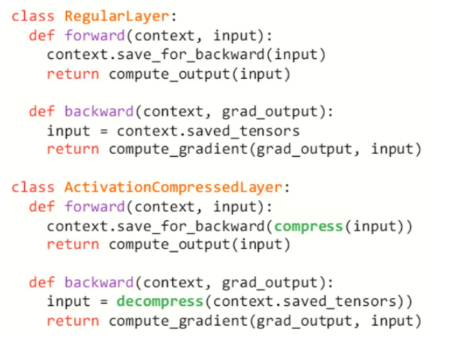

[toc]

# 重计算（Gradient checkpointing/Rematerialization) 

# 使用 CPU 内存进行交换 (swapping) 

# 使用分布式训练将 Tensor 分散存储在多个 GPU 上

# ActNN

ActNN是基于 PyTorch的。

在前向传播中，每一层的中间结果都要被存下来用于计算反向传播的梯度。这些中间结果，又被叫做「激活值」（activation)，实际上占据了大部分的内存消耗，尤其是在 batch size 较大或者输入图片较大的时候。**ActNN 的原理是就是压缩这些激活值来节省内存**。ActNN可以运作在GPU上。

## 实现

对于一个 PyTorch nn Module，我们只需要在其 forward 函数里加入量化压缩，在其 backward 函数里加入解压缩操作。



## **两行代码即可在 PyTorch 中使用**

```
import actnn
model = actnn.QModule(model)
```

